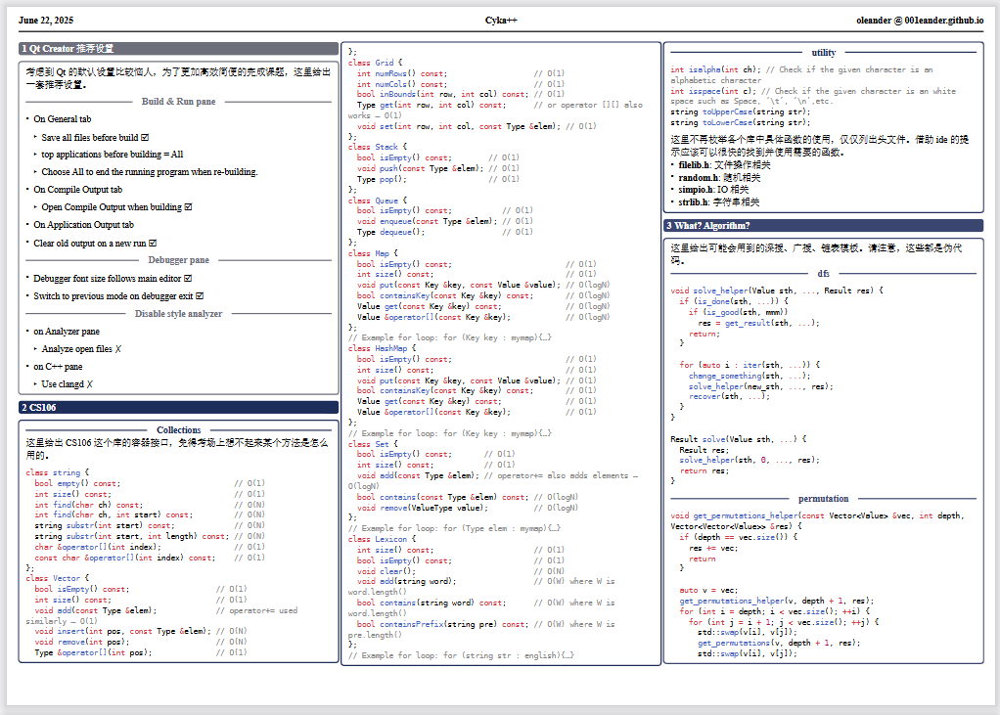

# 高级程序设计

本仓库含有上海财经大学 2024 学年下半学期**高级程序设计**这一门课程的作业、往年试卷（题目和答案）以及 cheatsheet。

时间仓促，没来的及认真修订以及解析。

如有疏漏，请提 issue/给我发邮件/微信或线下真实我。

## Cheatsheet

[下载链接](./cheatsheet/main.pdf)

## DONE

- [x] 完成样卷
  - [x] 信管班
  - [x] 大数据
- [x] cheatsheet
  - [x] QT Creator 的必要调教
  - [x] CS106 库的基本内容
  - [x] 算法模板

## TODO

- [ ] 完成模拟试题
  - [ ] 出卷
  - [ ] 解答
  - [ ] 解析
